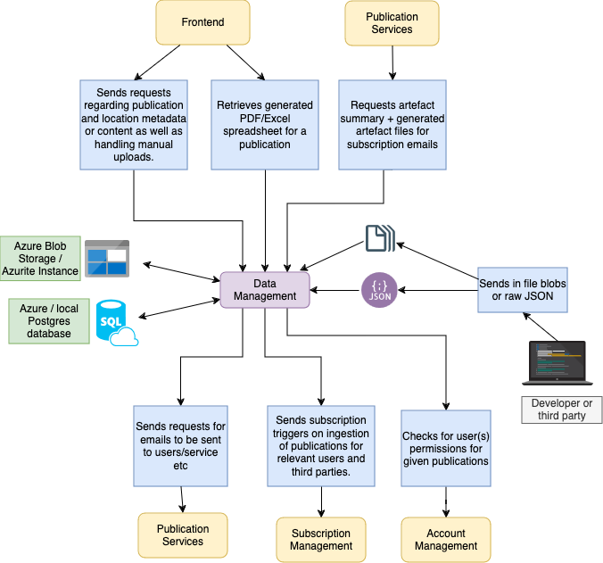

# pip-data-management


## Table of Contents

- [Overview](#overview)
- [Features and Functionality](#features-and-functionality)
- [Architecture Diagram](#architecture-diagram)
- [Getting Started](#getting-started)
  - [Prerequisites](#prerequisites)
  - [Installation](#installation)
  - [Configuration](#configuration)
    - [Environment variables](#environment-variables)
      - [Getting all environment variables with python]()
      - [Runtime secrets](#runtime-vars)
      - [Test secrets](#test-vars)
- [API Documentation](#api-documentation)
- [Examples](#examples)
  - [Uploading a new publication](#uploading-a-new-publication)
  - [Getting a list of all hearing locations](#getting-a-list-of-all-hearing-locations)
  - [Getting a specific hearing location](#getting-a-specific-hearing-location)
- [Deployment](#deployment)
- [Monitoring and Logging](#monitoring-and-logging)
  - [Application Insights](#application-insights)
- [Security Considerations](#security-considerations)
- [Troubleshooting](#troubleshooting)
- [Test Suite](#test-suite)
- [Contributing](#contributing)
- [Changelog](#changelog)
- [License](#license)
- [Acknowledgments](#acknowledgments)


## Overview
`pip-data-management` is a microservice that deals with most operations relating to data persistence within the Court and Tribunal Hearings Service (CaTH hereafter) written with Spring Boot/Java.

In practice, the service is usually containerized within a hosted kubernetes environment within Azure.

Broadly speaking, this service has two main components relating to the persistence, validation, retrieval and manipulation of court publications and canonical location information (reference data).

##### Publications
- Uploading publications to the service
- Validation of publications before publication (JSON)
- Retrieval of existing publications and metadata
- Archival processes to handle mandated data retention periods

##### Locations
- Retrieving individual locations or lists of locations
- Uploading and validation of location reference data
- Deletion of locations where appropriate.

Most interactions with `pip-data-management` are performed through the API (specified in [API Documentation](#api-documentation)) either as a standalone service or via connections to other microservices.

## Features and Functionality

- Uploading/retrieval/deletion of publications into the service.
- Interfacing with local or hosted Postgres instances for metadata and retrieval and Azure Blob Storage for raw files.
- Parsing and validation of ingested json files.
- Flyway for database modifications via SQL ingestion.
- Secure/Insecure Mode: Use of bearer tokens for authentication with the secure instance (if desired)
- Azure Blob Storage: Handles interactions with the CaTH Azure Blob Storage instance (or local Azurite emulator/Azure Storage Explorer instances)
- Endpoints which interact with scheduled cronjobs for daily tasks (e.g. retention period checks for archival purposes within `pip-cron-trigger`)
- OpenAPI Spec/Swagger-UI: Documents and allows users or developers to access API resources within the browser.
- Integration tests using TestContainers for dummy database operations.

## Architecture Diagram



The above diagram is somewhat simplified for readability (e.g. it does not include secure/insecure communications, but those are covered elsewhere).

## Getting Started

### Prerequisites

##### General

- [Java JDK 17](https://openjdk.org/projects/jdk/17/) - this is used throughout all of our services.
- REST client of some description (e.g. [Curl](https://github.com/curl/curl), [Insomnia](https://insomnia.rest/), [Postman](https://www.postman.com/)). Swagger-UI can also be used to send requests.
- Docker - used to run integration tests due to our use of [TestContainers](https://www.testcontainers.org/)

##### Local development

- [Azurite](https://learn.microsoft.com/en-us/azure/storage/common/storage-use-azurite) - Local Azure emulator used along with Azure Storage explorer for local storage.
- [Azure Storage Explorer](https://azure.microsoft.com/en-us/products/storage/storage-explorer) - Used for viewing and storing blobs within an Azurite instance locally.

##### Nice-to-haves

- [pip-dev-env](https://github.com/hmcts/pip-dev-env) - This repo provides a development environment wherein ensure all microservices, as well as external services (e.g. postgres & redis) are all running in tandem within the service. It eases the development process and is particularly helpful when working with cross-service communication, as it also reduces strain on local performance from having many separate IDE windows open.
- PostgreSQL - for local development, it will help to install Postgres. Ensure your postgres instance matches the relevant [environment variables](#environment-variables). Most devs on the project are just using this within a docker container.
- Some means of interfacing with the postgres database either locally or remotely. Good options include [DataGrip](https://www.jetbrains.com/datagrip/), [pgAdmin](https://www.pgadmin.org/) or [psql](https://www.postgresql.org/docs/9.1/app-psql.html). This will allow you to verify the impacts of your requests on the underlying database.

### Installation

- Clone the repository
- Ensure all required [environment variables](#environment-variables) have been set.
- Build using the command `./gradlew clean build`
- Start the service using the command `./gradlew bootrun` in the newly created directory.

### Configuration

#### Environment Variables

Environment variables are used by the service to control its behaviour in various ways.


These variables can be found within various separate CaTH Azure keyvaults. You may need to obtain access to this via a support ticket.
- Runtime secrets are stored in `pip-ss-{env}-kv` (where {env} is the environment where the given instance is running (e.g. production, staging, test, sandbox)).
- Test secrets are stored in `pip-bootstrap-{env}-kv` with the same convention.

##### Get environment variables with python scripts
Python scripts to quickly grab all environment variables (subject to Azure permissions) are available for both [runtime](https://github.com/hmcts/pip-dev-env/blob/master/get_envs.py) and [test](https://github.com/hmcts/pip-secret-grabber/blob/master/main.py) secrets.

##### Runtime secrets

Below is a table of currently used environment variables for starting the service, along with a descriptor of their purpose and whether they are optional or required.

|Variable|Description|Required?|
|:----------|:-------------|------|
|SPRING_PROFILES_ACTIVE|If set equal to `dev`, the application will run in insecure mode (i.e. no bearer token authentication required for incoming requests.) *Note - if you wish to communicate with other services, you will need to set them all to run in insecure mode in the same way.*|No|
|APP_URI|Uniform Resource Identifier - the location where the application expects to receive bearer tokens after a successful authentication process. The application then validates received bearer tokens using the AUD parameter in the token|No|
|CLIENT_ID|Unique ID for the application within Azure AD. Used to identify the application during authentication.|No|
|TENANT_ID|Directory unique ID assigned to our Azure AD tenant. Represents the organisation that owns and manages the Azure AD instance.|No|
|CLIENT_SECRET|Secret key for authentication requests to the service.|No|
|CONNECTION_STRING|Connection string for connecting to the Azure Blob Storage service. Only required when running the application locally via Azurite.|Yes|
|STORAGE_ACCOUNT_NAME|Azure storage account name used to construct the storage account endpoint. Not required when running the application locally.|No|
|DB_HOST|Postgres Hostname|Yes|
|DB_PORT|Postgres Port|Yes|
|DB_NAME|Postgres Db name|Yes|
|DB_USER|Postgres Username|Yes|
|DB_PASS|Postgres Password|Yes|
|ACCOUNT_MANAGEMENT_URL|URL used for connecting to the pip-account-management service. Defaults to staging if not provided.|No|
|CHANNEL_MANAGEMENT_URL|URL used for connecting to the pip-channel-management service. Defaults to staging if not provided.|No|
|PUBLICATION_SERVICES_URL|URL used for connecting to the pip-publication-services service. Defaults to staging if not provided.|No|
|SUBSCRIPTION_MANAGEMENT_URL|URL used for connecting to the pip-subscription-management service. Defaults to staging if not provided.|No|
|CHANNEL_MANAGEMENT_AZ_API|Used as part of the `scope` parameter when requesting a token from Azure. Used for service-to-service communication with the pip-channel-management service|No|
|SUBSCRIPTION_MANAGEMENT_AZ_API|Used as part of the `scope` parameter when requesting a token from Azure. Used for service-to-service communication with the pip-subscription-management service|No|
|PUBLICATION_SERVICES_AZ_API|Used as part of the `scope` parameter when requesting a token from Azure. Used for service-to-service communication with the pip-publication-services service|No|
|ACCOUNT_MANAGEMENT_AZ_API|Used as part of the `scope` parameter when requesting a token from Azure. Used for service-to-service communication with the account management service|No|
| ENABLE_TESTING_SUPPORT_API     | Used to conditionally enable testing support API. Default to `false` for the production environment only.|No|

##### Additional Test secrets

Secrets required for getting tests to run correctly can be found in the below table:

|Variable|Description|
|:-------|:----------------|
|CLIENT_ID|As above|
|CLIENT_SECRET|As above|
|APP_URI|As above|
|SUBSCRIPTION_MANAGEMENT_AZ_API|As above|
|TENANT_ID|As above|
|ACCOUNT_MANAGEMENT_AZ_API|As above|
|PUBLICATION_SERVICES_AZ_API|As above|
|SYSTEM_ADMIN_PROVENANCE_ID|Value for the provenance of a system admin used as a header on authentication-bound tests.|
|TEST_USER_ID|User ID for a test account used as a header for most publication tests.|

#### Application.yaml files
The service can also be adapted using the yaml files found in the following locations:
- `src/main/resources/application.yaml` for changes to the behaviour of the service itself.
- `src/main/resources/application-dev.yaml` for changes to the behaviour of the service when running locally.
- `src/functionalTest/resources/application-functional.yaml` for changes to the application when it's running functional tests.
- `src/functionalTest/resources/application-view.yaml` for changes to postgres view tests.
- `src/test/resources/application-test.yaml` for changes to other test types (e.g. unit tests).

## API Documentation
Our full API specification can be found within our Swagger-UI page.
It can be accessed locally by starting the service and going to [http://localhost:8090/swagger-ui/swagger-ui/index.html](http://localhost:8090/swagger-ui/swagger-ui/index.html)
Alternatively, if you're on our VPN, you can access the swagger endpoint at our staging URL (ask a teammate to give you this).

## Search Criteria

The 'search' field forms part of the response back from the POST /publication endpoint.

The field contains values extracted from the payload that are then used by users in the frontend to search for publications when setting up subscriptions.

The values are extracted using JPATH (Jayway implementation). This is an example of the extracted values:

```json
{
  "cases":[{
    "caseUrn": "ExampleURN",
    "caseName": "ExampleName",
    "caseNumber": "ExampleNumber"
  }],
  "parties": [
    {
      "cases": [{
        "caseUrn": "ExampleURN",
        "caseName": "ExampleName",
        "caseNumber": "ExampleNumber"
      }],
      "organisations": [
        "Org name"
      ],
      "individuals": [
        {
          "forename": "Forename",
          "middleName": "M",
          "surname": "Surname"
        }
      ]
    }
  ]
}
```

The 'parties' section is used for searching the matched publications when adding subscriptions in the frontend. It excludes representatives, and blank / null party roles. For individual names, only the surname is used for searching. However the forenames and middle names are also stored so that full names can be displayed on the subscription tables.

The legacy 'cases' section is used for search by case Number, URN or Name for publications created previously before "parties" were added.

## Examples
As mentioned, the full api documentation can be found within swagger-ui, but some of the most common operations are highlighted below.

Most of the communication with this service benefits from using secure authentication. While possible to stand up locally in insecure mode, to simulate a production environment it is better to use secure mode.
Before sending in any requests to the service, you'll need to obtain a bearer token using the following approach:

### Requesting a bearer token
To request a bearer token, sending a post request following this template:
```
curl --request POST \
  --url https://login.microsoftonline.com/{TENANT_ID}/oauth2/v2.0/token \
  --header 'Content-Type: multipart/form-data' \
  --form client_id={CLIENT_ID_FOR_ANOTHER_SERVICE} \
  --form scope={APP_URI}/.default \
  --form client_secret={CLIENT_SECRET_FOR_ANOTHER_SERVICE}\
  --form grant_type=client_credentials
```
You can copy the above curl command into either Postman or Insomnia and they will automatically be converted to the relevant formats for those programs.

*Note - the `_FOR_ANOTHER_SERVICE` variables need to be extracted from another registered microservice within the broader CaTH umbrella (e.g. [pip-subscription-management](https://github.com/hmcts/pip-subscription-management))*

### Uploading a new publication
The following request is a template which can be used to input a new list or publication at the `/publication` post endpoint.
```
curl --request POST \
  --url http://localhost:8090/publication \
  --header 'Authorization: Bearer {BEARER_TOKEN_HERE}' \
  --header 'Content-Type: application/json' \
  --header 'x-content-date: {DATE_IN_ISO_FORMAT_WITH_NO_OFFSET}' \
  --header 'x-court-id: {LOCATION_ID_OF_DESIRED_LOCATION}' \
  --header 'x-display-from: {DATE_IN_ISO_FORMAT_WITH_NO_OFFSET}' \
  --header 'x-display-to: {DATE_IN_ISO_FORMAT_WITH_NO_OFFSET}' \
  --header 'x-language: {ENGLISH or WELSH or BI_LINGUAL}' \
  --header 'x-list-type: {LIST_TYPE}' \
  --header 'x-provenance: {MANUAL_UPLOAD}' \
  --header 'x-source-artefact-id: {FILENAME_IF_PROVENANCE_IS_MANUAL_UPLOAD}' \
  --header 'x-type: {"LIST" or "GENERAL_PUBLICATION"}' \
  --data '{YOUR_JSON_HERE}'
```

### Getting a list of all hearing locations
The following request returns a list of all hearing locations with metadata such as region, location-type, jurisdiction, welsh names etc.
Hearing locations are ingested into the system using the reference data endpoint.
```
curl --request GET \                                                                                                    13:40:44
          --url http://localhost:8090/locations \
          --header 'Authorization: Bearer {BEARER_TOKEN_HERE}'
```

### Getting a specific hearing location
The following request returns location metadata for an individual court.
```
curl --request GET \                                                                                                    13:40:44
          --url http://localhost:8090/locations/{LOCATION_ID_OF_DESIRED_LOCATION} \
          --header 'Authorization: Bearer {BEARER_TOKEN_HERE}'
```

## Deployment
We use [Jenkins](https://www.jenkins.io/) as our CI/CD system. The deployment of this can be controlled within our application logic using the various `Jenkinsfile`-prepended files within the root directory of the repository.

Our builds run against our `dev` environment during the Jenkins build process. As this is a microservice, the build process involves standing up the service in a docker container in a Kubernetes cluster with the current staging master copies of the other interconnected microservices.

If your debugging leads you to conclude that you need to implement a pipeline fix, this can be done in the [CNP Jenkins repo](https://github.com/hmcts/cnp-jenkins-library)

## Creating or debugging of SQL scripts with Flyway
Flyway is used to apply incremental schema changes (migrations) to our database.

### Pipeline
Flyway is enabled on the pipeline, but is run at startup then switched off.

### Local
For local development, flyway is turned off by default. This is due to all tables existing within a single database locally. This can cause flyway to fail at startup due to mismatching scripts.

If you wish to test a flyway script locally, you will first need to clear the `flyway_schema_history` table then set the environment variable `ENABLE_FLYWAY` to true.

## Monitoring and Logging
We utilise [Azure Application Insights](https://learn.microsoft.com/en-us/azure/azure-monitor/app/app-insights-overview) to store our logs. Ask a teammate for the specific resource in Azure to access these.
Locally, we use [Log4j](https://logging.apache.org/log4j/2.x/).

In addition, this service is also monitored in production and staging environments by [Dynatrace](https://www.dynatrace.com/). The URL for viewing our specific Dynatrace instance can be had by asking a team member.

### Application Insights

Application insights is configured via the lib/applicationinsights.json file. Alongside this, the Dockerfile is configured to copy in this file and also download the app insights client.

The client at runtime is attached as a javaagent, which allows it to send the logging to app insights.

To connect to app insights a connection string is used. This is configured to read from the KV Secret mounted inside the pod.

It is possible to connect to app insights locally, although somewhat tricky. The easiest way is to get the connection string from azure, set it as an environment variable (APPLICATIONINSIGHTS_CONNECTION_STRING), and add in the javaagent as VM argument. You will also need to remove / comment out the connection string line the config.

## Security & Quality Considerations
We use a few automated tools to ensure quality and security within the service. A few examples can be found below:

 - SonarCloud - provides automated code analysis, finding vulnerabilities, bugs and code smells. Quality gates ensure that test coverage, code style and security are maintained where possible.
 - DependencyCheckAggregate - Ensures that dependencies are kept up to date and that those with known security vulnerabilities (based on the [National Vulnerability Database(NVD)](https://nvd.nist.gov/)) are flagged to developers for mitigation or suppression.
 - JaCoCo Test Coverage - Produces code coverage metrics which allows developers to determine which lines of code are covered (or not) by unit testing. This also makes up one of SonarCloud's quality gates.
 - PMD - Static code analysis tool providing code quality guidance and identifying potential issues relating to coding standards, performance or security.
 - CheckStyle - Enforces coding standards and conventions such as formatting, naming conventions and structure.

## Test Suite

This microservice is comprehensively tested using both unit and functional tests.

### Unit tests

Unit tests can be run on demand using `./gradlew test`.

### Functional tests

Functional tests can be run using `./gradlew functional`

For our functional tests, we are using Square's [MockWebServer](https://github.com/square/okhttp/tree/master/mockwebserver) library. This allows us to test the full HTTP stack for our service-to-service interactions.
We also use TestContainers to create throwaway postgres databases for testing to protect our prod and staging databases.

## Contributing
We are happy to accept third-party contributions. See [.github/CONTRIBUTING.md](./.github/CONTRIBUTING.md) for more details.

## License
This project is licensed under the MIT License - see the [LICENSE](./LICENSE) file for details.
